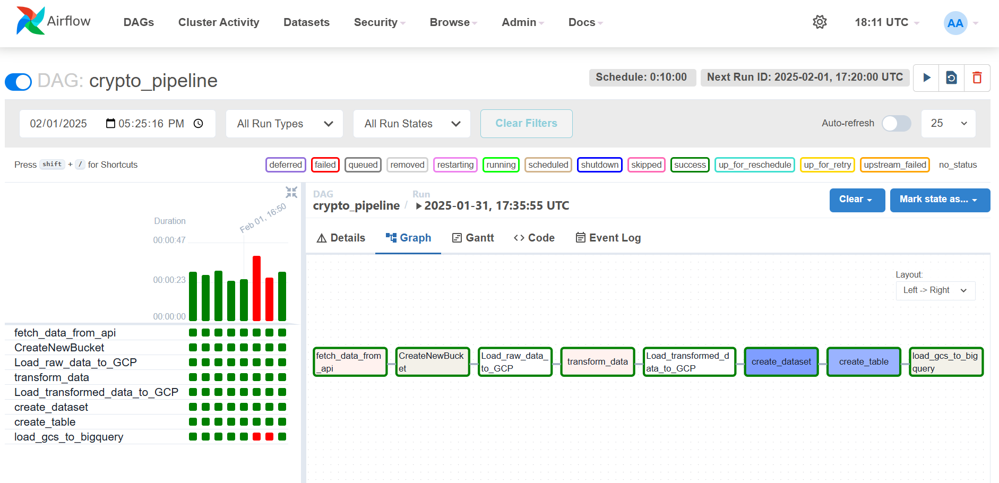

# **Crypto-Data-Pipeline-Google Cloud Platform**

This project implements an **ETL Pipeline for Cryptocurrency Data** using **Google Cloud Platform (GCP)** services such as **Google Cloud Storage (GCS)**, **BigQuery**, and **Apache Airflow** from google composer for automation. The goal is to extract real-time **cryptocurrency market data**, transform it, and load it into **BigQuery** for further analysis and visualization.

---

## **Workflow** 

### **1. Data Extraction: CoinGecko API & Apache Airflow**
A **CoinGecko API** is used to extract real-time cryptocurrency data in **JSON format**. The connection is established through **HTTP requests**, and the extracted data is stored in **Google Cloud Storage (GCS)**.

The **`crypto_pipeline.py`** script:
1. Retrieves cryptocurrency market details using the **CoinGecko API**.
2. Saves the raw **JSON data** into a **Google Cloud Storage (GCS) bucket** (`crypto_data_manvith`) under the folder `raw_data/`. The file is named using a **timestamp** for unique identification.
3. Triggers the **data transformation process** using Apache Airflow.

This function runs **every 10 minutes**, scheduled via **Apache Airflow**.

---

### **2. Data Transformation: Pandas & Google Cloud Storage**
The transformation process is implemented in the **_transform function_** inside the `crypto_pipeline.py` script using **Pandas**.

**Steps performed:**
1. Reads the raw **JSON data** from Google Cloud Storage.
2. Processes relevant cryptocurrency details:
   - **ID, Symbol, Name, Current Price, Total Volume, Price Change in 24h, Total Supply, Max Supply, Last Updated Timestamp**
3. Performs **data cleaning** and **formatting**:
   - Converts **timestamps** to UTC format.
   - Ensures numerical data is properly formatted.
4. Saves the **transformed data** as a **CSV file** in **GCS** under `transformed_data/`.

---

### **3. Data Loading: Google BigQuery**
A **BigQuery dataset (`crypto_db`) and table (`crypto_tb`)** are created to store the cryptocurrency data.

#### **Snowpipe Integration:**
1. A **Google Cloud Storage bucket (`crypto_data_manvith`)** is used as a staging area.
2. The **transformed CSV file** is loaded into **BigQuery** using the **`GCSToBigQueryOperator`**.
3. The table is automatically updated **every 10 minutes**.

---

### **4. Data Analytics: Querying with BigQuery**
Once the data is stored in **BigQuery**, SQL queries can be executed to analyze **cryptocurrency trends**.

